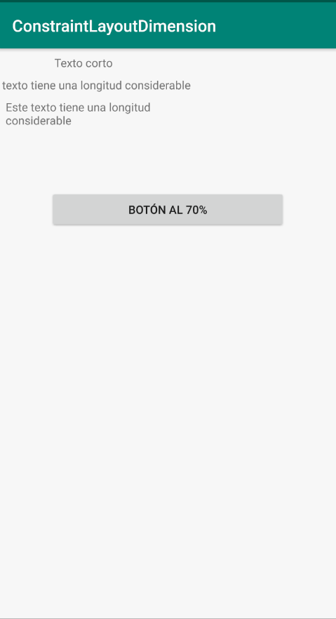

# Ejemplo dimensiones en ConstraintLayout
Puedes descargar este ejemplo para ver las restricciones de dimensión  
que afectan a un widget. En cada apartado de los apuntes se estudiarán  
los casos concretos.

